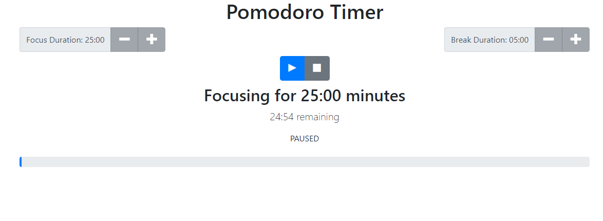

 # Pomodoro-Timer
 
This app enables the user to use the pomodoro time-management technique. The focus duration can be set from 5 to 60 minutes and the break duration can be set from 1 to 15 minutes.

## Links

## Installation

1. Run `npm install` to install project dependencies.
1. Run `npm run start` to start project

The deafult URL locations will be http://localhost:3000.

## Screenshot

### Pomodoro Timer

The selected focus time is displayed along with a countdown and a progress bar. When the time ends the break begings and it counts down.
The focus duration can be incremented in intervals of 5 while the break duration is incremented in intervals of 1.

## Technology

### Built with:
* REACT & Bootstraps
  * created with create-react-app
